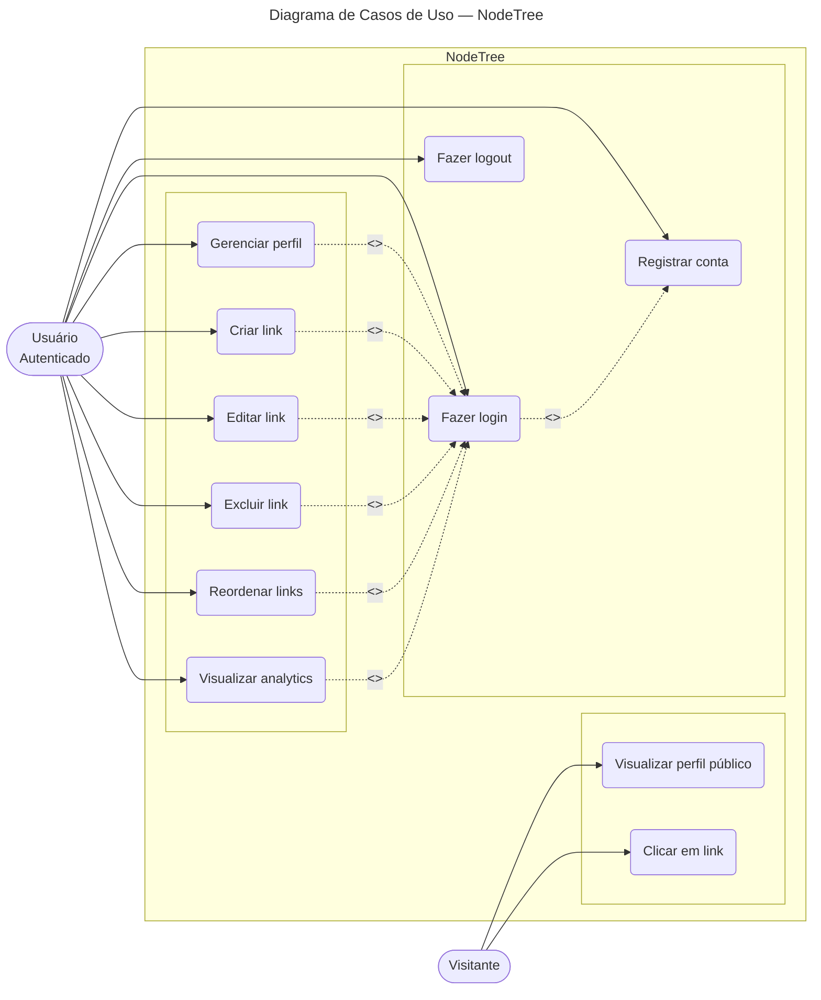

# Diagrama de Casos de Uso — NodeTree

## Atores

| Ator | Descrição |
|---|---|
| **Visitante** | Usuário não autenticado que navega por perfis públicos |
| **Usuário Autenticado** | Usuário registrado e logado que gerencia seu perfil e links |

## Casos de uso

### Visita

| # | Caso de uso | Ator | Descrição | Endpoint |
|---|---|---|---|---|
| UC01 | Visualizar perfil público | Visitante | Acessa a página pública de um usuário pelo slug | `GET /users/:slug` |
| UC02 | Clicar em link | Visitante | Registra um clique em um link da página pública | `POST /clicks/:linkId` |

### Autenticação

| # | Caso de uso | Ator | Descrição | Endpoint |
|---|---|---|---|---|
| UC03 | Registrar conta | Usuário | Cria nova conta com email, senha e slug | `POST /auth/register` |
| UC04 | Fazer login | Usuário | Autentica e recebe token JWT | `POST /auth/login` |
| UC05 | Fazer logout | Usuário | Encerra a sessão | `POST /auth/logout` |

### Gerenciamento

| # | Caso de uso | Ator | Descrição | Endpoint |
|---|---|---|---|---|
| UC06 | Gerenciar perfil | Usuário | Altera dados do perfil (nome, bio, avatar, tema) | `PUT /users/me` |
| UC07 | Criar link | Usuário | Adiciona novo link ao perfil | `POST /links` |
| UC08 | Editar link | Usuário | Altera título ou URL de um link | `PUT /links/:id` |
| UC09 | Excluir link | Usuário | Remove um link e seus registros de clique | `DELETE /links/:id` |
| UC10 | Reordenar links | Usuário | Altera a ordem dos links via drag-and-drop | `PUT /links/reorder` |
| UC11 | Visualizar analytics | Usuário | Consulta estatísticas de cliques | `GET /links/analytics` |

## Notações UML

| Símbolo | Significado |
|---|---|
| `⟶` | Comunicação entre ator e caso de uso |
| `-.-` `<<include>>` | O caso base sempre executa o caso incluído |
| `-.-` `<<extend>>` | O caso base pode, opcionalmente, estender-se |
