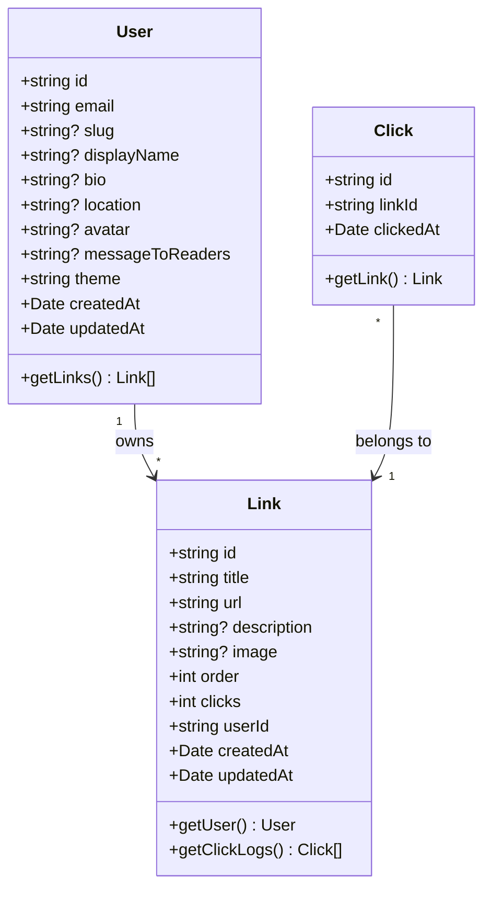

# Diagrama de classes

Os tipos estão definidos em dois locais:

- **`shared/types/index.ts`** — interfaces `User` e `Link` (compartilhadas entre frontend e backend, sem dependências)
- **`client/src/services/api.ts`** — interfaces `LinkData`, `UpdateLinkData`, `UpdateUserData` (específicas do cliente) e redefinições de `Link` e `User` com tipos serializados (string para Date)
