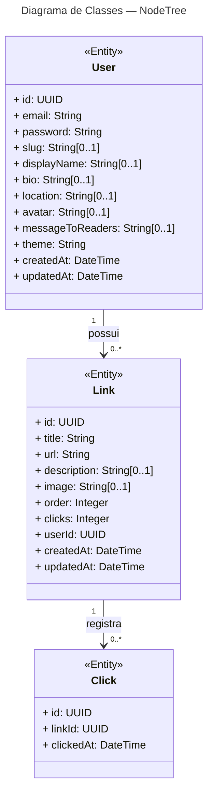

# Diagrama de Classes — NodeTree

## Notações

| Símbolo | Significado |
|---|---|
| `+` | Visibilidade pública (UML) |
| `<<Entity>>` | Entidade persistente no banco de dados |
| `UUID`, `String`, `Integer`, `DateTime` | Tipos dos atributos |
| `[0..1]` | Atributo opcional (nullable) |
| `1 → 0..*` | Relação um para muitos (agregação) |

## Mapeamento para o banco

| Classe | Tabela |
|---|---|
| `User` | `users` |
| `Link` | `links` |
| `Click` | `clicks` |

### Chaves estrangeiras

| Origem | Destino | Deleção em cascata |
|---|---|---|
| `links.user_id` → `users.id` | `Link.userId` → `User.id` | Sim |
| `clicks.link_id` → `links.id` | `Click.linkId` → `Link.id` | Sim |
