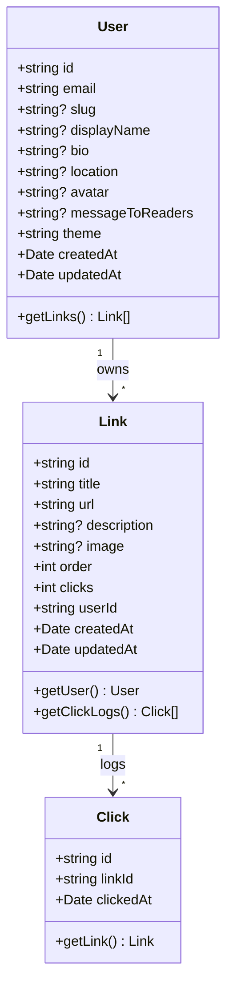

# Diagrama de classes TypeScript

```mermaid
classDiagram
    class User {
        +string id
        +string email
        +string? slug
        +string? displayName
        +string? bio
        +string? location
        +string? avatar
        +string? messageToReaders
        +string theme
        +Date createdAt
        +Date updatedAt
        +getLinks() Link[]
    }

    class Link {
        +string id
        +string title
        +string url
        +string? description
        +string? image
        +int order
        +int clicks
        +string userId
        +Date createdAt
        +Date updatedAt
        +getUser() User
        +getClickLogs() Click[]
    }

    class Click {
        +string id
        +string linkId
        +Date clickedAt
        +getLink() Link
    }

    User "1" --> "*" Link : owns
    Link "1" --> "*" Click : logs
```

As entidades estão definidas no schema Prisma em `server/prisma/schema.prisma`. Os tipos TypeScript correspondentes estão em `shared/types/index.ts`.
