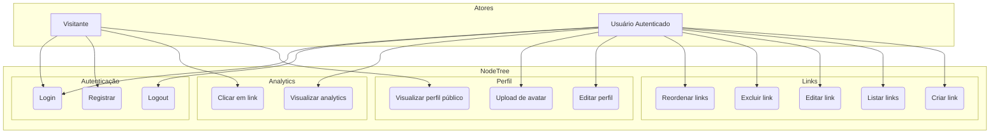

# Diagrama de Casos de Uso

Este documento descreve os casos de uso do NodeTree, um agregador de links pessoais com analytics.

## Atores

| Ator | Descrição |
|---|---|
| **Visitante** | Usuário não autenticado que navega pela página pública de um perfil |
| **Usuário Autenticado** | Usuário registrado e logado que gerencia seu próprio perfil e links |

## Diagrama

## Descrição dos casos de uso

### Autenticação

| Caso de uso | Ator | Descrição | Endpoint |
|---|---|---|---|
| **Registrar** | Visitante | Criar nova conta com email, senha e slug | `POST /auth/register` |
| **Login** | Visitante / Usuário | Autenticar com email e senha, receber JWT | `POST /auth/login` |
| **Logout** | Usuário | Limpar cookie de autenticação | `POST /auth/logout` |

### Perfil

| Caso de uso | Ator | Descrição | Endpoint |
|---|---|---|---|
| **Visualizar perfil público** | Visitante | Acessar página pública de um usuário pelo slug | `GET /users/:slug` |
| **Editar perfil** | Usuário | Alterar nome, bio, localização, tema, mensagem | `PUT /users/me` |
| **Upload de avatar** | Usuário | Enviar foto de perfil | `POST /upload` |

### Links

| Caso de uso | Ator | Descrição | Endpoint |
|---|---|---|---|
| **Criar link** | Usuário | Adicionar novo link ao perfil | `POST /links` |
| **Listar links** | Visitante / Usuário | Visualizar links de um perfil (por userId ou slug) | `GET /links?userId=` / `GET /links/public/:slug` |
| **Editar link** | Usuário | Alterar título ou URL de um link | `PUT /links/:id` |
| **Excluir link** | Usuário | Remover um link (cascade deleta cliques) | `DELETE /links/:id` |
| **Reordenar links** | Usuário | Alterar a ordem dos links via drag-and-drop | `PUT /links/reorder` |

### Analytics

| Caso de uso | Ator | Descrição | Endpoint |
|---|---|---|---|
| **Clicar em link** | Visitante | Registrar clique em link (incrementa contador + log) | `POST /clicks/:linkId` |
| **Visualizar analytics** | Usuário | Ver estatísticas de cliques dos links | `GET /links/analytics` |

## Regras de negócio

1. **Slug único**: o slug define a URL pública do perfil (`/:slug`) e deve ser único
2. **Perfil público**: qualquer visitante pode ver o perfil e clicar nos links, sem autenticação
3. **Gerenciamento privado**: apenas o dono do perfil (autenticado) pode criar, editar, excluir e reordenar links
4. **Clique atômico**: o registro do clique é transacional (incremento + log) — não há perda de analytics
